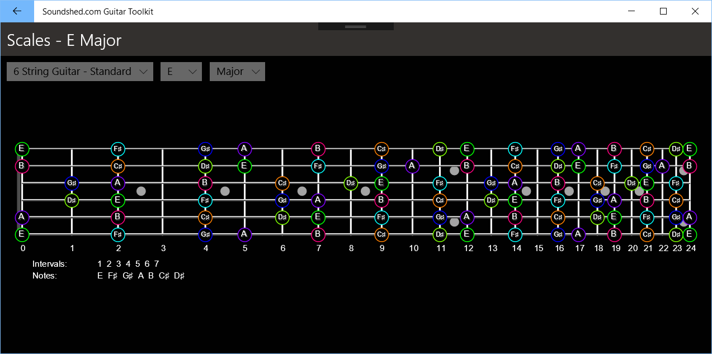
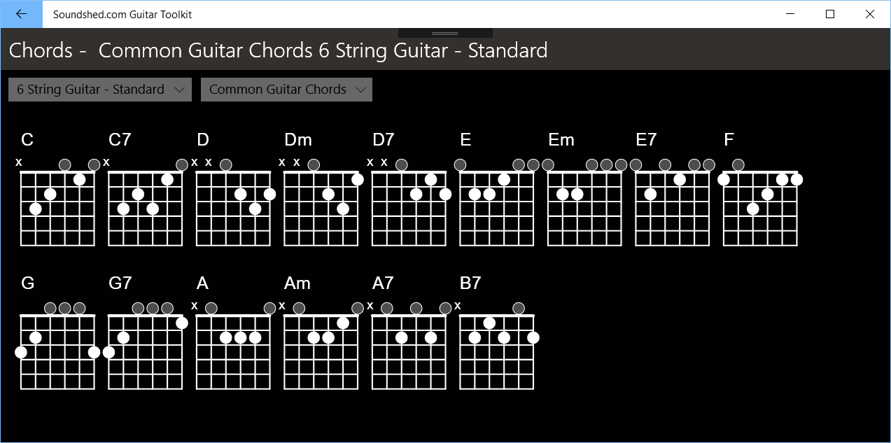
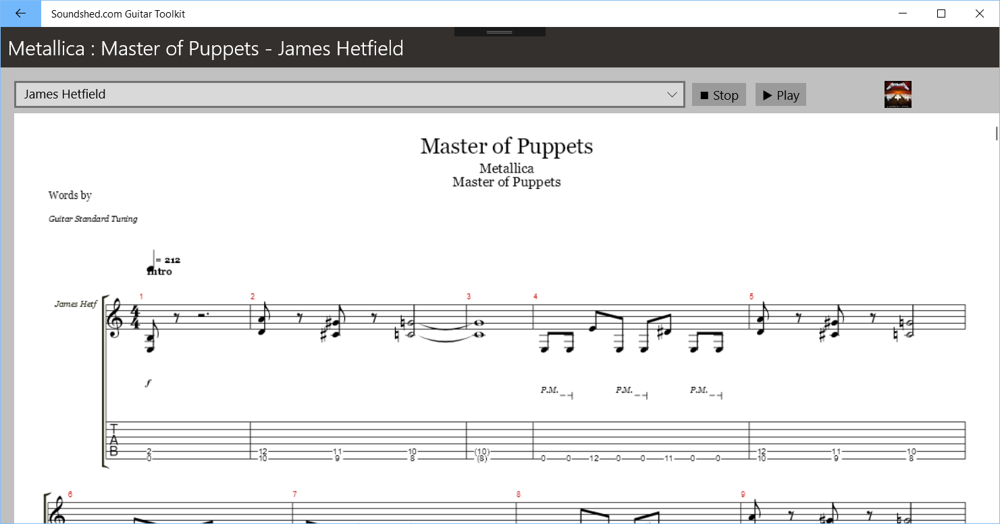

# Scalex Guitar Toolkit
A cross-platform .net based guitar toolkit providing Scales, Chords and Tablature.

This app is a work in progress cross platform version (mainly using Xamarin Forms).

## Scales

## Chords

## Tablature

The Tablature feature uses AlphaTab for rendering and the Songsterr API for content.

## History
Scalex was originally written in Turbo Pascal in 1994. In 2001 the scale diagram logic was ported to C# and some of that code remains today (sort of). 

Over the years versions of this app have been ported to a number of platforms:
- A windows forms desktop app
- A WPF desktop app
- Web based (both aspx rendering to PNG and JavaScript transpiled using SharpKit)
- A WPF app for Windows Phone and Windows Store (Soundshed.com Guitar Toolkit)
- A mobile web app (iOS and Android)

